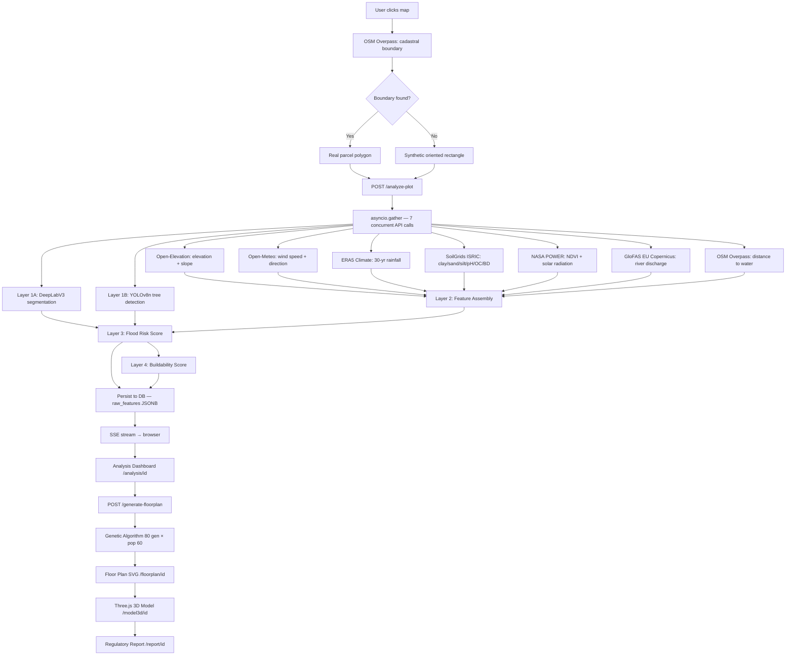
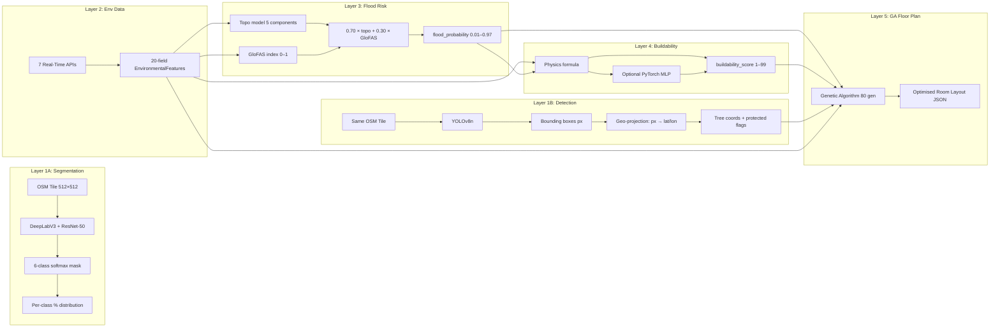
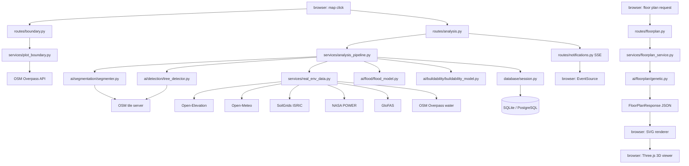
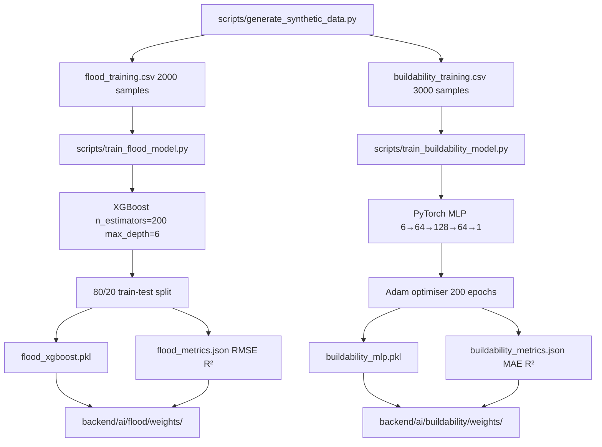
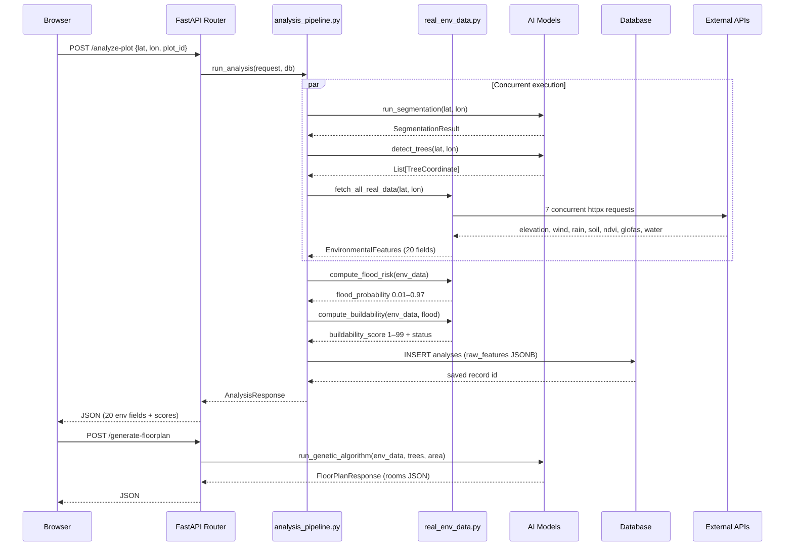

# ECO-3D Studio — Deep Architecture Documentation

> Complete system design, data pipeline, ML pipeline, and component responsibility reference.

---

## Table of Contents

1. [System Overview](#1-system-overview)
2. [Component Architecture](#2-component-architecture)
3. [Data Flow Diagram](#3-data-flow-diagram)
4. [ML Pipeline: Layer-by-Layer Deep Dive](#4-ml-pipeline-layer-by-layer-deep-dive)
5. [Semantic Segmentation — DeepLabV3 + ResNet-50](#5-semantic-segmentation--deeplabv3--resnet-50)
6. [Object Detection — YOLOv8n](#6-object-detection--yolov8n)
7. [Flood Risk Model — Physics + XGBoost](#7-flood-risk-model--physics--xgboost)
8. [Buildability Model — Physics + PyTorch MLP](#8-buildability-model--physics--pytorch-mlp)
9. [Genetic Algorithm Floor Plan Optimizer](#9-genetic-algorithm-floor-plan-optimizer)
10. [Real-Time Environmental Data Pipeline](#10-real-time-environmental-data-pipeline)
11. [Frontend Architecture](#11-frontend-architecture)
12. [Backend Architecture](#12-backend-architecture)
13. [Database Architecture](#13-database-architecture)
14. [Module Interaction Diagram](#14-module-interaction-diagram)
15. [Training Pipeline](#15-training-pipeline)
16. [Inference Pipeline](#16-inference-pipeline)
17. [Security Architecture](#17-security-architecture)

---

## 1. System Overview

ECO-3D Studio is a geospatial AI platform with three architectural tiers:

```
┌────────────────────────────────────────────────────────────┐
│  PRESENTATION TIER — Next.js 14 / React 18 / Three.js      │
│  Map → Analysis Dashboard → Floor Plan → 3D Model → Report │
└─────────────────────────┬──────────────────────────────────┘
                          │ HTTP/JSON + JWT Bearer + SSE
┌─────────────────────────▼──────────────────────────────────┐
│  APPLICATION TIER — FastAPI / Python 3.11 / Uvicorn ASGI   │
│  5-Layer AI Pipeline + 7 Real-Time API Integrations        │
└──────────────┬──────────────────────────┬──────────────────┘
               │                          │
┌──────────────▼──────┐    ┌─────────────▼──────────────────┐
│  DATA TIER          │    │  EXTERNAL DATA TIER             │
│  SQLite / PostgreSQL│    │  Open-Elevation · Open-Meteo    │
│  + PostGIS          │    │  SoilGrids · NASA POWER         │
│  Async SQLAlchemy   │    │  GloFAS · OSM Overpass          │
└─────────────────────┘    └────────────────────────────────┘
```

**Design principles:**
- **Crash-proof by design** — every external API and ML model has a seeded-random deterministic fallback
- **Async throughout** — all I/O uses Python `asyncio` / `httpx`; frontend uses React concurrent features
- **Real data first** — all environmental inputs are sourced from live public APIs, not synthetic data
- **Progressive disclosure** — SSE streams pipeline progress to the browser layer by layer

---

## 2. Component Architecture

### Frontend Components

```
frontend/
├── app/                            Next.js App Router pages
│   ├── page.tsx                    Landing page
│   ├── map/page.tsx                Plot selection — Leaflet + OSM
│   ├── analysis/[id]/page.tsx      5-panel analysis dashboard
│   ├── floorplan/[id]/page.tsx     GA floor plan + 2D canvas viewer
│   ├── model3d/[id]/page.tsx       Three.js 3D open-top viewer
│   └── report/[id]/page.tsx        Regulatory PDF report
│
├── components/
│   ├── MapComponent.tsx            Leaflet wrapper with boundary rendering
│   └── Notifications.tsx           SSE-driven notification feed
│
├── lib/api.ts                      Axios client with JWT interceptor;
│                                   typed wrappers for all backend endpoints
└── store/useEco3DStore.ts          Zustand: global state atom
                                    (lat, lon, polygon, plotId,
                                     analysis, floorPlan, loading flags)
```

### Backend Components

```
backend/
├── main.py                         FastAPI app factory; CORS; lifespan hook
├── config.py                       Pydantic Settings (env-var based config)
│
├── routes/                         HTTP handler layer
│   ├── analysis.py                 POST /analyze-plot → pipeline dispatch
│   ├── floorplan.py                POST /generate-floorplan
│   ├── boundary.py                 GET /plot-boundary
│   ├── plots.py                    CRUD /plots
│   ├── report.py                   GET /report/{id}
│   ├── auth.py                     POST /auth/signup, /auth/login, GET /auth/me
│   └── notifications.py            GET /notifications/stream (SSE)
│
├── services/                       Business logic layer
│   ├── analysis_pipeline.py        5-layer pipeline orchestrator
│   ├── real_env_data.py            7 async API fetches + physics formulas
│   ├── floorplan_service.py        Floor plan business logic
│   ├── plot_boundary.py            OSM cadastral boundary detection
│   └── legal_verification.py       Zoning / flood zone checks
│
├── ai/                             ML inference layer
│   ├── segmentation/segmenter.py   DeepLabV3 satellite segmentation
│   ├── detection/tree_detector.py  YOLOv8n tree detection + geo-projection
│   ├── flood/flood_model.py        XGBoost flood risk regression
│   ├── buildability/               PyTorch MLP buildability regression
│   │   └── buildability_model.py
│   └── floorplan/genetic.py        Genetic algorithm floor plan optimizer
│
├── models/schemas.py               Pydantic v2 request/response schemas
└── database/
    ├── connection.py               SQLAlchemy engine + init_db()
    ├── models.py                   ORM table definitions (cross-DB UUID)
    └── session.py                  Async session factory + dependency
```

---

## 3. Data Flow Diagram



---

## 4. ML Pipeline: Layer-by-Layer Deep Dive



---

## 5. Semantic Segmentation — DeepLabV3 + ResNet-50

### Concept

Semantic segmentation assigns a class label to every pixel in an image. Unlike object detection (bounding boxes), segmentation produces a dense prediction map — the same spatial resolution as the input.

### Mathematical Intuition

**Convolution operation:**
```
(I * K)[i,j] = ΣΣ I[i+m, j+n] × K[m,n]
```
where `I` is the input feature map and `K` is a learnable kernel. Convolution extracts local features (edges, textures) at multiple scales.

**Atrous (dilated) convolution:**
```
(I *_d K)[i,j] = ΣΣ I[i + d·m, j + d·n] × K[m,n]
```
Dilation rate `d` inserts zeros between kernel elements, expanding the receptive field without reducing spatial resolution or increasing parameter count. ECO-3D uses dilation rates `{1, 6, 12, 18}` in the Atrous Spatial Pyramid Pooling (ASPP) module, allowing the model to simultaneously capture:
- Fine-grained local features (d=1)
- Medium-scale context (d=6)
- Large-scale land-cover regions (d=12, 18)

**ResNet-50 Backbone:**
50-layer residual network with skip connections: `H(x) = F(x) + x`. Skip connections solve the vanishing gradient problem, enabling training of deep networks. Pre-trained on ImageNet (1000-class, ~1.28M images). In ECO-3D, the backbone weights are loaded from PyTorch's torchvision and optionally fine-tuned.

**ImageNet normalisation:**
```python
transforms.Normalize(mean=[0.485, 0.456, 0.406], std=[0.229, 0.224, 0.225])
```
These are the empirical per-channel mean and standard deviation of the ImageNet training set. Normalising to this distribution is required because the pretrained weights were optimised under it.

### Implementation in ECO-3D

1. **Tile fetch** — `_fetch_satellite_tile(lat, lng, zoom=18)` converts lat/lon to XYZ tile coordinates using the Web Mercator projection:
   ```python
   x = int((lng + 180) / 360 * 2^zoom)
   y = int((1 - log(tan(lat_r) + 1/cos(lat_r)) / π) / 2 * 2^zoom)
   ```
   The tile is fetched from OSM tile server at 256×256 px and resized to 512×512.

2. **Inference** — `_run_inference(image)` normalises the image with ImageNet statistics, runs a forward pass through DeepLabV3, and applies argmax across the class dimension to produce a (512×512) integer mask.

3. **COCO→ECO remapping** — The 21 COCO classes are remapped to 6 ECO-3D classes. Pixels not explicitly mapped default to `bare_land`.

4. **Distribution** — Class pixel counts are divided by total pixels to produce per-class area fractions.

5. **Fallback** — If PyTorch is unavailable or inference fails, `_synthetic_mask()` generates a deterministic hardcoded mask.

---

## 6. Object Detection — YOLOv8n

### Concept

YOLO (You Only Look Once) is a single-stage object detector that predicts bounding boxes and class probabilities in a single forward pass. YOLOv8 nano (`n`) is the smallest variant, optimised for speed.

### Mathematical Intuition

YOLOv8 divides the input image into a grid and, for each grid cell, predicts:
- `(x, y)` — bounding box centre offset
- `(w, h)` — bounding box dimensions (log-space relative to anchor)
- `objectness` — confidence that a tree is present
- `class_probability` — per-class softmax scores

**Non-Maximum Suppression (NMS):**
After inference, overlapping boxes are deduplicated. IoU = `area(A ∩ B) / area(A ∪ B)`. Boxes with IoU > 0.45 are suppressed, keeping only the highest-confidence detection.

ECO-3D configuration: `conf=0.35` (confidence threshold), `iou=0.45` (NMS IoU threshold).

### Geo-Projection

Pixel coordinates `(px, py)` in the 256×256 tile are projected back to geographic coordinates using:

```python
lat = lat_max − (py / tile_size) × (lat_max − lat_min)
lon = lon_min + (px / tile_size) × (lon_max − lon_min)
```

The tile's geographic bounding box `(lat_min, lat_max, lon_min, lon_max)` is computed from the XYZ tile indices using the inverse Mercator formula.

**Canopy radius estimation:**
```python
tile_width_m = (lon_max − lon_min) × 111_320 × cos(lat_center)
canopy_radius = (bbox_width_px / tile_size) × tile_width_m / 2
```
Trees with `canopy_radius > 5 m` are flagged as **protected** and their bounding boxes are passed to the Genetic Algorithm as hard exclusion zones.

---

## 7. Flood Risk Model — Physics + XGBoost

### Physics Model (Primary)

The primary flood risk computation is a deterministic weighted sum of five terrain and environmental factors:

```
topo_model = 0.42 × elev_risk          # elevation below 80 m sea level
           + 0.20 × slope_risk         # slope < 12° = flat land pools water
           + 0.16 × rain_risk          # rainfall from ERA5 30-yr normal
           + 0.13 × clay_risk          # impermeable clay fraction
           + 0.09 × water_risk         # proximity to rivers/lakes

elev_risk  = max(0, 1 − elevation / 80)
slope_risk = max(0, 1 − slope / 12)
rain_risk  = clip((rainfall − 300) / 2700,  0, 1)
clay_risk  = clay_pct / 100
water_risk = max(0, 1 − dist_water / 400)

When GloFAS data available:
  flood_risk = 0.70 × topo_model + 0.30 × glofas_index
```

The 70/30 blending ratio reflects the relative epistemic quality of topographic inference vs direct hydrological measurement.

### XGBoost Model (Supplemental)

**Concept:** XGBoost (Extreme Gradient Boosting) builds an ensemble of decision trees sequentially. Each new tree corrects the residual error of the previous ensemble:

```
F_m(x) = F_{m-1}(x) + η × h_m(x)
```

where `h_m(x)` is the m-th regression tree fitted to the negative gradient of the loss, and `η` is the learning rate.

**Mathematical foundation:**

The objective at step m is:
```
Obj = Σ_i L(y_i, ŷ_i^{(m-1)} + h_m(x_i)) + Ω(h_m)
```

Using a second-order Taylor expansion:
```
Obj ≈ Σ_i [g_i h_m(x_i) + ½ h_i h_m(x_i)²] + Ω(h_m)

where  g_i = ∂L/∂ŷ^{(m-1)}_i   (first-order gradient)
       h_i = ∂²L/∂(ŷ^{(m-1)}_i)² (second-order gradient)
```

This closed-form enables efficient tree construction and is XGBoost's key advantage over naive gradient boosting.

**Training data generation** (physics-informed, 2000 samples):

```python
P(flood) = 0.40 × max(0, 1 − elev/100)
         + 0.15 × max(0, 1 − slope/30)
         + 0.10 × max(0, (rain − 500)/2500)
         + 0.15 × max(0, 1 − NDVI)
         + 0.10 × max(0, 1 − dist_water/500)
         + 0.10 × soil_stability
         + ε,    ε ~ N(0, 0.05)
```

**Inputs:** elevation (m), slope (°), NDVI (0–1), rainfall (mm/yr), soil stability (0–1), distance to water (m)

**Output:** flood probability ∈ [0, 1]

**Reported metrics:** Train RMSE ~0.038, R² ~0.946; Test RMSE ~0.042, R² ~0.941

---

## 8. Buildability Model — Physics + PyTorch MLP

### Physics Model (Primary)

The buildability score integrates all six SoilGrids properties with environmental factors:

```
score = 100
  − flood_risk × 38
  − min(slope, 35) × 0.85
  − 50   if USDA texture ∈ {Heavy Clay, Peat/Mud}
  − (clay_pct − 35) × 0.4   [only if clay_pct > 35]
  − 5    if soil_ph < 5.0 or > 8.5
  − 8    if bulk_density < 1.0 g/cm³
  − 4    if bulk_density > 1.8 g/cm³
  + ndvi × 8
  + min(sun_hours, 14) × 1.2
  − min(wind_ms, 15) × 0.5
  [+ elevation zone adjustments]
∈ [1, 99]
```

### PyTorch MLP (Supplemental)

**Architecture:**
```
Input(6) → Linear(6→64) → ReLU → Dropout(0.1) →
           Linear(64→128) → ReLU → Dropout(0.1) →
           Linear(128→64) → ReLU →
           Linear(64→1)
Total parameters: 17,217
```

**Input features (6):**
```python
x = [flood_probability,          # 0–1
     slope / 45,                  # normalised
     min(clay_pct, 60) / 60,      # soil stability proxy
     vegetation_density,          # NDVI 0–1
     min(wind_ms, 15) / 15,       # wind exposure
     min(sun_hours, 12) / 12]     # solar access
```

**Mathematical intuition:**

A two-layer fully connected network `f(x) = W₂ · ReLU(W₁ · x + b₁) + b₂` is a universal function approximator for continuous functions on compact domains (Universal Approximation Theorem). With 3 hidden layers (6→64→128→64→1), the network can learn arbitrary non-linear interactions between the 6 inputs.

**ReLU activation:** `max(0, x)` — piecewise linear, computationally efficient, avoids the vanishing gradient problem of sigmoid/tanh.

**Dropout (p=0.1):** During training, each neuron is randomly zeroed with probability 0.1. This prevents co-adaptation between neurons and reduces overfitting.

**Loss function:** Mean Squared Error `L = 1/N × Σ (ŷ_i − y_i)²`

**Optimiser:** Adam (Adaptive Moment Estimation):
```
m_t = β₁ m_{t-1} + (1−β₁) g_t          # 1st moment (gradient)
v_t = β₂ v_{t-1} + (1−β₂) g_t²         # 2nd moment (squared gradient)
θ_t = θ_{t-1} − η × m̂_t / (√v̂_t + ε)
```
Default: β₁=0.9, β₂=0.999, ε=1e-8.

**Training:** 200 epochs, batch size 32, 3,000 synthetic physics-informed samples. Reported Test MAE ~4.2 points, R² ~0.912.

---

## 9. Genetic Algorithm Floor Plan Optimizer

### Concept

A genetic algorithm (GA) is an evolutionary optimisation method inspired by natural selection. A population of candidate solutions (chromosomes) is iteratively improved through selection, crossover, and mutation.

### Chromosome Encoding

Each chromosome `C` represents a complete floor plan:

```python
class Chromosome:
    rooms: List[Dict]       # [{type, x, y, w, h, floor, orientation}]
    orientation: float      # building rotation in degrees
    plot_w: float
    plot_h: float
```

Room dimensions are initialised as `min_w + U(0, 2)` × `min_h + U(0, 1.5)` where U is uniform random. Positions are uniform random within plot bounds.

### Fitness Function

```
fitness(C) = 0.35 × f_sunlight(C)
           + 0.25 × f_ventilation(C)
           + 0.25 × f_structural(C)
           + 0.15 × 0.8  [tree preservation — static placeholder]
```

**f_sunlight:** South-facing priority rooms (living room, kitchen, study) are scored by their y-position relative to plot height. Lower y = more south-facing = higher score.

```python
f_sunlight = Σ (1 − y/plot_h) for each priority room / n_priority_rooms
```

**f_ventilation:** The building orientation is scored by alignment with the ideal NW–SE cross-ventilation axis (315°):

```python
angle_diff = |orientation − 315°| mod 180°
f_ventilation = 1 − (angle_diff / 180)
```

Real wind direction from Open-Meteo is factored in by adjusting the target orientation angle.

**f_structural:** Penalises overlapping rooms:

```python
f_structural = 1 − (n_overlapping_pairs / max_possible_pairs)
```

Room overlap is tested with AABB (Axis-Aligned Bounding Box) intersection:
```python
overlap = NOT (a.x + a.w ≤ b.x  OR  b.x + b.w ≤ a.x  OR
               a.y + a.h ≤ b.y  OR  b.y + b.h ≤ a.y)
```

### Evolution Loop

```
INITIALISE population of 60 random chromosomes
FOR generation in range(80):
    EVALUATE fitness for all chromosomes
    SELECT elite (top 33%) → carry forward unchanged
    CROSSOVER remaining slots:
        Select 2 parents proportional to fitness (roulette wheel)
        Child inherits rooms from parent1 + orientation from parent2
    MUTATE each non-elite chromosome with prob 0.20:
        Randomly reposition one room OR mutate orientation by ±45°
RETURN fittest chromosome
```

**Population size 60, 80 generations** → 4,800 fitness evaluations. At ~O(n²) overlap checks for n=7 rooms, total computational cost is ~4800 × 21 = ~100k operations — completes in milliseconds.

---

## 10. Real-Time Environmental Data Pipeline

### Concurrency Model

```python
results = await asyncio.gather(
    fetch_elevation_slope(lat, lon),
    fetch_wind(lat, lon),
    fetch_rainfall(lat, lon),
    fetch_soil_data(lat, lon),
    fetch_ndvi_and_solar(lat, lon),
    fetch_flood_discharge(lat, lon),
    fetch_distance_to_water(lat, lon),
    return_exceptions=True  # one failure doesn't cancel others
)
```

All seven I/O-bound API calls run concurrently on the Python asyncio event loop. Total latency = max(individual API times) ≈ 15–20 s worst case, not Σ = 90 s sequential.

### USDA Texture Triangle Classification

The USDA Texture Triangle maps clay/sand/silt percentage fractions to 12 texture classes. Implementation in `_usda_texture(clay, sand, silt)`:

| Priority | Condition | Class | Buildable? |
|---|---|---|---|
| 1 | clay ≥ 55% | Heavy Clay | No |
| 2 | clay ≥ 40% | Clay | No |
| 3 | clay ≥ 27%, sand < 45% | Clay Loam | Yes |
| 4 | clay ≥ 27%, sand ≥ 45% | Sandy Clay | Yes |
| 5 | clay ≥ 20%, silt ≥ 27% | Silty Clay Loam | Yes |
| 6 | clay ≥ 7%, sand ≥ 52% | Sandy Loam | Yes |
| 7 | clay ≥ 7%, silt ≥ 50% | Silt Loam | Yes |
| 8 | clay ≥ 7% | Loam | Yes |
| 9 | sand ≥ 85% | Sand | Yes |
| 10 | sand ≥ 70% | Loamy Sand | Yes |
| 11 | silt ≥ 80% | Silt | Yes |
| default | — | Sandy Loam | Yes |

### NDVI Proxy Derivation (NASA POWER)

NDVI cannot be computed directly from NASA POWER's surface radiation parameters. The platform uses a physically-motivated proxy chain:

```
Step 1: FPAR estimation
   FPAR = (avg_PAR_clear × 0.45) / (avg_SW_all × 0.48)
   
   Rationale: Healthy vegetation intercepts ~45% of clear-sky PAR.
   Total shortwave = ~48% of all-sky shortwave on average.

Step 2: NDVI approximation
   NDVI ≈ FPAR × 0.72 + 0.05
   
   Rationale: Empirical regression FPAR↔NDVI correlation (Myneni et al. 1994).
   Coefficient 0.72 reflects typical canopy architecture; 0.05 is bare soil offset.
```

Values are averaged over 365 daily observations to produce an annual mean.

### Sun Hours Calculation (NOAA Formula)

```python
# Julian Day Number
doy = datetime.date.today().timetuple().tm_yday

# Solar declination (degrees)
decl = 23.45 × sin(360/365 × (doy − 81))

# Hour angle at sunrise/sunset
cos_ha = −tan(φ) × tan(decl)
cos_ha = clip(cos_ha, −1, 1)   # polar night / midnight sun clamp

# Hours of daylight
sun_hours = 2 × degrees(acos(cos_ha)) / 15
```

This is the NOAA sunrise equation derived from spherical trigonometry. It requires only latitude (φ) and Julian day — no external API call.

---

## 11. Frontend Architecture

### State Management (Zustand)

The global Zustand store `useEco3DStore` holds the complete session state:

```typescript
interface Eco3DState {
  selectedLat: number | null;
  selectedLon: number | null;
  selectedPolygon: number[][] | null;
  currentPlotId: string | null;
  analysis: AnalysisResponse | null;       // all 20 env fields
  floorPlan: FloorPlanResponse | null;
  environmentalData: AnalysisResponse["environmental"] | null;
  isAnalyzing: boolean;
  isGeneratingFloorPlan: boolean;
  error: string | null;
}
```

State flows unidirectionally: user interaction → store update → React re-render. No prop drilling across deep component trees.

### Three.js 3D Viewer Architecture

**Coordinate system:** Three.js uses a right-handed Y-up coordinate system. The 2D floor plan (x, y in metres) is mapped to Three.js XZ coordinates, with walls extruded upward along Y.

**Raycasting pattern:**
```typescript
// Disable raycasting on decorative meshes to prevent null crashes
const NOOP_RAYCAST = () => {};
// Mesh ref setup
ref={r => { if (r) r.raycast = NOOP_RAYCAST; }}
```

**Procedural normal mapping:**
1. `_noise2d(x, y)` — smooth value noise via bilinear interpolation of `sin()` hash
2. `_fbm(x, y, oct)` — fractal Brownian motion: `Σ a^i × noise(2^i × p)`
3. `_buildHeightfield(sz, fn)` — rasterise noise to Float32Array
4. `_heightToNormal(h, sz, strength)` — finite-difference gradient → RGB normal map:
   ```
   Nx = (H[x-1,y] − H[x+1,y]) × strength
   Ny = (H[x,y-1] − H[x,y+1]) × strength
   Nz = 1.0
   → Normalise → map to [0,255] RGB
   ```

**Camera presets:**
- Isometric: position `(25, 20, 25)`, target `(0, 0, 0)`
- Top-Down: position `(0, 35, 0)`, target `(0, 0, 0)`
- Interior: position `(0, 2, 10)`, target `(0, 1, 0)`

### Map Architecture (Leaflet)

The OSM Overpass cadastral boundary query uses a priority cascade:
1. `boundary=cadastral` tagged ways within 200 m
2. Smallest containing way ≤ 10,000 m² area
3. Nominatim reverse geocode → administrative boundary
4. Synthetic 20 m × 15 m oriented rectangle (fallback)

Plot boundary search does NOT auto-select on text search — only fires on explicit user click.

---

## 12. Backend Architecture

### FastAPI Application Structure

```python
@asynccontextmanager
async def lifespan(app: FastAPI):
    await init_db()                 # create tables on startup
    logger.info("ECO-3D backend ready")
    yield                           # app runs
    # cleanup on shutdown (none required currently)

app = FastAPI(lifespan=lifespan)
app.add_middleware(CORSMiddleware, allow_origins=["*"])
```

Routes are registered via `app.include_router()`. Each router defines its own prefix and tag for OpenAPI documentation.

### Async Pipeline Execution

The analysis pipeline uses `run_in_executor` to run CPU-bound ML inference (PyTorch, YOLOv8) on a thread pool executor, preventing blocking of the asyncio event loop:

```python
loop = asyncio.get_event_loop()
seg_result = await loop.run_in_executor(None, run_segmentation, lat, lon)
```

I/O-bound API calls use native `async/await` with `httpx.AsyncClient`.

### SSE Progress Streaming

```python
from sse_starlette.sse import EventSourceResponse

async def stream_analysis(lat, lon, db):
    async def event_generator():
        yield {"data": "Layer 1: Segmentation..."}
        seg = await run_segmentation_async(lat, lon)
        yield {"data": f"Layer 2: Fetching real env data..."}
        env = await fetch_all_real_data(lat, lon)
        # ...
    return EventSourceResponse(event_generator())
```

The browser connects via `new EventSource("/notifications/stream")` and receives progress events as each pipeline layer completes.

---

## 13. Database Architecture

### ORM Models

```python
class AnalysisRecord(Base):
    __tablename__ = "analyses"
    id            = Column(String(36), primary_key=True, default=lambda: str(uuid.uuid4()))
    plot_id       = Column(String(64), nullable=False, index=True)
    # Core indexed fields
    ndvi          = Column(Float)
    elevation     = Column(Float)
    slope         = Column(Float)
    flood_probability  = Column(Float, index=True)
    buildability_score = Column(Float, index=True)
    # All 20 extended environmental fields stored as JSONB
    raw_features  = Column(JSON)
    created_at    = Column(DateTime, default=datetime.utcnow)
```

The `raw_features` JSON column stores all 20 extended environmental fields (soil profile, GloFAS data, NASA POWER data) alongside the core indexed columns. This design enables fast queries on the most common filter dimensions (flood, buildability, plot_id) while preserving schema flexibility for new API fields.

### Session Factory

```python
async_session = sessionmaker(
    engine, class_=AsyncSession, expire_on_commit=False
)

async def get_db():
    async with async_session() as session:
        yield session
```

The `expire_on_commit=False` setting prevents SQLAlchemy from expiring ORM objects after commit, which would trigger lazy-loading errors in async context.

---

## 14. Module Interaction Diagram



---

## 15. Training Pipeline



**Physics-informed data generation ensures the synthetic training data reflects real geophysical relationships.** The labels are deterministic functions of inputs plus Gaussian noise — models must learn the underlying physics, not memorise noise.

---

## 16. Inference Pipeline



---

## 17. Security Architecture

| Concern | Implementation |
|---|---|
| Authentication | JWT (HS256) via python-jose, 24-hr TTL |
| Password hashing | bcrypt (adaptive, work factor 12) |
| CORS | FastAPI CORSMiddleware — `allow_origins=["*"]` in dev; restrict in prod |
| SQL injection | SQLAlchemy ORM with parameterised queries; no raw SQL |
| Input validation | Pydantic v2 strict schema validation on all request bodies |
| Error exposure | Global exception handler returns sanitised messages; full trace in server logs only |
| Database credentials | Stored in `.env` file (not committed); loaded via `python-dotenv` |
| API keys | None required for any external data source |

**Production hardening recommendations:**
- Restrict CORS to `NEXT_PUBLIC_API_URL` origin
- Add rate limiting (e.g., `slowapi`) to `/analyze-plot` — each request makes 7 external API calls
- Implement Redis refresh token rotation
- Enable HTTPS-only cookie for JWT in production
